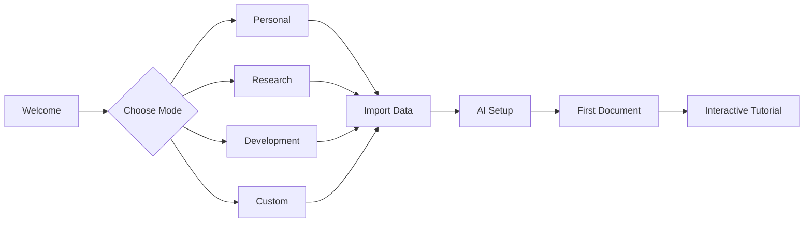

# Product Requirements Document: KnowledgeOS Platform
## An AI-Powered Knowledge Operating System

### Version 1.0 | August 2025

---

## 1. Executive Summary

### 1.1 Vision Statement
KnowledgeOS is a revolutionary knowledge management platform that transforms how humans interact with information, combining the editing power of VS Code, the knowledge management elegance of Obsidian, and the intelligence of modern AI to create a universal "operating system for thought."

### 1.2 Core Philosophy
- **Knowledge-First**: Every interaction creates persistent, searchable knowledge
- **AI-Native**: AI doesn't just assist; it actively organizes, connects, and enriches information
- **Universal Canvas**: One platform for all knowledge work - coding, writing, research, planning
- **Local-First**: Your data stays yours, with optional sync
- **Extensible**: Plugin architecture for infinite possibilities

### 1.3 Target Market Evolution
- **Phase 1**: Individual knowledge workers (developers, researchers, writers)
- **Phase 2**: Small teams and collaborative projects
- **Phase 3**: Enterprise knowledge management
- **Phase 4**: Educational institutions and specialized verticals

---

## 2. Product Architecture

### 2.1 Core Platform Layers

```
┌─────────────────────────────────────────────────────────┐
│                    Application Layer                      │
│  ┌─────────────────────────────────────────────────┐    │
│  │  Personal   Research   Code      Medical       │    │
│  │  Assistant  Assistant  Assistant  Assistant    │    │
│  └─────────────────────────────────────────────────┘    │
├───────────────────────────────────────────────────────────┤
│                    Plugin System                          │
│  ┌─────────────────────────────────────────────────┐    │
│  │  Custom    Themes    Language   Workflow       │    │
│  │  Agents    & UI      Packs      Automations    │    │
│  └─────────────────────────────────────────────────┘    │
├───────────────────────────────────────────────────────────┤
│                    Intelligence Layer                     │
│  ┌─────────────────────────────────────────────────┐    │
│  │  Multi-AI   Context    Knowledge  Learning     │    │
│  │  Router     Engine     Extractor  System       │    │
│  └─────────────────────────────────────────────────┘    │
├───────────────────────────────────────────────────────────┤
│                    Knowledge Core                         │
│  ┌─────────────────────────────────────────────────┐    │
│  │  Graph      Markdown   Search     Version      │    │
│  │  Database   Engine     Index      Control      │    │
│  └─────────────────────────────────────────────────┘    │
├───────────────────────────────────────────────────────────┤
│                    Foundation Layer                       │
│  ┌─────────────────────────────────────────────────┐    │
│  │  Electron   Monaco     File       Security     │    │
│  │  Runtime    Editor     System     & Crypto     │    │
│  └─────────────────────────────────────────────────┘    │
└─────────────────────────────────────────────────────────┘
```

### 2.2 Modular Components

#### 2.2.1 Knowledge Core
- **Unified Knowledge Graph**: Neo4j-style graph database for relationships
- **Markdown Runtime**: Enhanced markdown with computational notebooks
- **Bidirectional Sync**: Real-time syncing between files and graph
- **Semantic Index**: Vector embeddings for similarity search
- **Temporal Tracking**: Time-based knowledge evolution

#### 2.2.2 Intelligence Layer
- **AI Orchestrator**: Routes to optimal AI model based on task
- **Context Manager**: Maintains conversation context across sessions
- **Knowledge Extractor**: Automatically structures unstructured data
- **Learning Loop**: Improves based on user corrections
- **Privacy Shield**: Local LLM options and data anonymization

#### 2.2.3 Editor Framework
- **Monaco Core**: Full VS Code editing capabilities
- **Multi-Pane System**: Unlimited split views
- **Language Intelligence**: IntelliSense for 100+ languages
- **Collaborative Editing**: Real-time multi-user support
- **Version Control**: Built-in Git integration

#### 2.2.4 Plugin System
- **Plugin API**: Comprehensive JavaScript/TypeScript API
- **Marketplace**: Community plugins and themes
- **Sandboxing**: Secure plugin execution
- **Hot Reload**: Zero-downtime plugin updates
- **Revenue Sharing**: Monetization for developers

---

## 3. Core Features

### 3.1 Universal Knowledge Canvas

#### 3.1.1 Smart Documents
```typescript
interface SmartDocument {
  content: Markdown;
  metadata: {
    type: 'note' | 'code' | 'diagram' | 'dataset';
    tags: string[];
    connections: NodeReference[];
    ai_summary: string;
    confidence_score: number;
  };
  intelligence: {
    suggested_links: Connection[];
    related_documents: Document[];
    knowledge_gaps: Gap[];
    next_actions: Action[];
  };
}
```

#### 3.1.2 Knowledge Types
- **Notes**: Rich markdown with embedded media
- **Code**: Full IDE capabilities with debugging
- **Diagrams**: Mermaid, PlantUML, Excalidraw integration
- **Data**: Tables, charts, computational notebooks
- **Media**: Images, videos, audio with transcription

### 3.2 AI Capabilities

#### 3.2.1 Conversation Modes
```yaml
modes:
  personal_assistant:
    description: "Daily planning and personal knowledge"
    features: ["calendar", "tasks", "habits", "journal"]

  research_assistant:
    description: "Academic and professional research"
    features: ["citations", "literature_review", "hypothesis_testing"]

  code_assistant:
    description: "Software development companion"
    features: ["debugging", "refactoring", "documentation", "testing"]

  learning_assistant:
    description: "Educational and skill development"
    features: ["courses", "flashcards", "progress_tracking"]

  creative_assistant:
    description: "Writing and creative projects"
    features: ["brainstorming", "outlining", "worldbuilding"]
```

#### 3.2.2 AI Services
- **Multi-Provider Support**: OpenAI, Anthropic, Google, Local LLMs
- **Smart Routing**: Choose best model for each task
- **Context Window Management**: Efficient token usage
- **Conversation Memory**: Long-term memory across sessions
- **Fine-Tuning**: Custom models on user data (with permission)

### 3.3 Knowledge Management

#### 3.3.1 Organization Systems
- **Hierarchical Folders**: Traditional file system
- **Tag Taxonomy**: Flexible categorization
- **Graph Clusters**: Automatic topic detection
- **Smart Collections**: Dynamic filtered views
- **Workspaces**: Context switching for projects

#### 3.3.2 Linking & References
```markdown
[[Page Name]]                 # Wiki-style links
[[Page Name#Section]]         # Section links
[[Page Name^block-id]]        # Block references
![[Image.png]]               # Embedded files
{{query: #tag1 AND #tag2}}   # Dynamic queries
```

#### 3.3.3 Search Capabilities
- **Full-Text Search**: Instant results across all content
- **Semantic Search**: Find by meaning, not just keywords
- **Code Search**: Language-aware code searching
- **Regex Search**: Power user pattern matching
- **Search Operators**: Complex queries with AND/OR/NOT

### 3.4 Automation & Workflows

#### 3.4.1 Template System
```javascript
// Template Engine
class Template {
  variables: Variable[];
  triggers: Trigger[];
  actions: Action[];

  async execute(context: Context) {
    // Automated document creation
    // Variable substitution
    // AI enhancement
  }
}
```

#### 3.4.2 Workflow Automation
- **Triggers**: Time, file change, external webhook
- **Actions**: Create, modify, organize, notify
- **Conditions**: If/then logic flows
- **Integrations**: Zapier, IFTTT, webhooks

### 3.5 Collaboration Features

#### 3.5.1 Sharing Modes
- **Read-Only**: Public knowledge bases
- **Collaborative**: Real-time editing
- **Commented**: Annotation and review
- **Forked**: Create derivatives

#### 3.5.2 Team Features
- **Shared Workspaces**: Team knowledge bases
- **Role Management**: Permissions and access control
- **Activity Feed**: See team changes
- **Merge Conflicts**: Smart resolution

---

## 4. Technical Requirements

### 4.1 Performance Specifications

| Metric | Target | Maximum |
|--------|--------|---------|
| Startup Time | < 2s | 5s |
| File Open | < 100ms | 500ms |
| Search Results | < 200ms | 1s |
| AI Response | < 2s | 10s |
| Graph Render (1000 nodes) | < 1s | 3s |
| Memory Usage | < 500MB | 2GB |
| Knowledge Base Size | 100GB | Unlimited |

### 4.2 Platform Requirements

#### 4.2.1 Desktop (Primary)
- **OS**: Windows 10+, macOS 11+, Ubuntu 20.04+
- **RAM**: 4GB minimum, 8GB recommended
- **Storage**: 2GB application, 10GB+ for knowledge
- **Display**: 1280x720 minimum

#### 4.2.2 Web (Future)
- **Browsers**: Chrome 90+, Firefox 88+, Safari 14+, Edge 90+
- **Features**: Progressive Web App with offline support

#### 4.2.3 Mobile (Future)
- **iOS**: 14.0+ with Files app integration
- **Android**: 10.0+ with document provider
- **Sync**: Seamless with desktop

### 4.3 Security & Privacy

#### 4.3.1 Data Security
```yaml
encryption:
  at_rest: AES-256
  in_transit: TLS 1.3
  key_management: User-controlled or managed

privacy:
  local_first: All processing on device by default
  opt_in_sync: Explicit consent for cloud features
  data_portability: Full export in open formats
  right_to_delete: Complete data removal
```

#### 4.3.2 AI Privacy
- **Local LLM Options**: Ollama, LM Studio integration
- **API Key Management**: Secure storage, never transmitted
- **Content Filtering**: PII detection and redaction
- **Audit Logs**: Track all AI interactions

---

## 5. Extensibility Framework

### 5.1 Plugin Architecture

#### 5.1.1 Plugin Types
```typescript
enum PluginType {
  AI_PROVIDER = 'ai_provider',        // Custom AI integrations
  KNOWLEDGE_SOURCE = 'knowledge',      // Import from external systems
  EDITOR_EXTENSION = 'editor',        // Monaco extensions
  THEME = 'theme',                    // UI customization
  WORKFLOW = 'workflow',              // Automation recipes
  EXPORT_FORMAT = 'export',           // Output formats
  SYNC_PROVIDER = 'sync'              // Cloud sync services
}
```

#### 5.1.2 Plugin API
```javascript
class KnowledgeOSPlugin {
  manifest: {
    id: string;
    name: string;
    version: string;
    permissions: Permission[];
  };

  async activate(context: ExtensionContext) {
    // Register commands
    // Add UI elements
    // Hook into events
  }

  async deactivate() {
    // Cleanup
  }
}
```

### 5.2 Application Templates

#### 5.2.1 Vertical Solutions
```yaml
personal_assistant:
  modules: [calendar, tasks, journal, habits]
  ai_mode: conversational
  default_views: [daily_note, task_list]

research_platform:
  modules: [citations, papers, notes, graphs]
  ai_mode: analytical
  default_views: [bibliography, research_graph]

code_workspace:
  modules: [ide, git, debugging, documentation]
  ai_mode: technical
  default_views: [editor, terminal, file_tree]

medical_records:
  modules: [patients, notes, medications, protocols]
  ai_mode: clinical
  compliance: HIPAA
  default_views: [patient_list, encounter_notes]

legal_practice:
  modules: [cases, documents, research, billing]
  ai_mode: legal
  compliance: [confidentiality, audit_trail]
  default_views: [case_files, document_drafts]

educational_platform:
  modules: [courses, lessons, assessments, progress]
  ai_mode: tutoring
  default_views: [curriculum, student_progress]
```

### 5.3 Integration Ecosystem

#### 5.3.1 Data Sources
- **Cloud Storage**: Dropbox, Google Drive, OneDrive
- **Note Apps**: Notion, Evernote, Roam, Obsidian
- **Dev Tools**: GitHub, GitLab, Jira, Linear
- **Productivity**: Slack, Teams, Discord, Email
- **Databases**: PostgreSQL, MongoDB, Elasticsearch

#### 5.3.2 Export Formats
- **Documents**: PDF, DOCX, EPUB, LaTeX
- **Presentations**: PPTX, Reveal.js, Marp
- **Data**: CSV, JSON, SQL, GraphQL
- **Websites**: Static site generation
- **APIs**: REST, GraphQL endpoints

---

## 6. User Experience Design

### 6.1 Interface Principles

#### 6.1.1 Design Philosophy
- **Minimal Cognitive Load**: Information when needed
- **Progressive Disclosure**: Simple by default, powerful when needed
- **Keyboard-First**: Everything accessible via keyboard
- **Visual Hierarchy**: Clear importance indicators
- **Responsive Design**: Adapt to any screen size

#### 6.1.2 Core UI Components
```
┌─────────────────────────────────────────────────────┐
│ Command Palette (Cmd+K)                              │
├──────┬────────────────────────────────────┬──────────┤
│      │                                    │          │
│ Side │        Main Editor Canvas          │   AI     │
│ Bar  │                                    │  Panel   │
│      │      [Unlimited Split Panes]       │          │
│      │                                    │          │
├──────┴────────────────────────────────────┴──────────┤
│ Status Bar                                           │
└─────────────────────────────────────────────────────┘
```

### 6.2 Interaction Patterns

#### 6.2.1 Command System
- **Universal Command Palette**: Access everything
- **Natural Language Commands**: "Find all notes about project X"
- **Command Chaining**: Multiple actions in sequence
- **Smart Suggestions**: Learn from usage patterns

#### 6.2.2 Navigation
- **Quick Switcher**: Instant file jumping (Cmd+P)
- **Graph Navigation**: Visual knowledge exploration
- **Breadcrumbs**: Hierarchical location awareness
- **Back/Forward**: Browser-like history
- **Bookmarks**: Quick access to important items

### 6.3 Onboarding Flow



---

## 7. Monetization Strategy

### 7.1 Pricing Tiers

| Tier | Price | Features | Target |
|------|-------|----------|--------|
| **Personal** | Free | Core features, Local AI, 1GB sync | Individuals |
| **Pro** | $12/mo | Unlimited sync, Premium AI, Collaboration | Power users |
| **Team** | $25/user/mo | Shared workspaces, Admin controls | Small teams |
| **Enterprise** | Custom | SSO, Compliance, Support, Training | Organizations |

### 7.2 Revenue Streams

#### 7.2.1 Primary
- **Subscriptions**: Recurring SaaS revenue
- **AI Credits**: Usage-based AI API costs
- **Storage**: Additional cloud storage

#### 7.2.2 Secondary
- **Plugin Marketplace**: 30% revenue share
- **Template Store**: Premium templates
- **Training**: Enterprise workshops
- **Consulting**: Custom implementations

### 7.3 Market Expansion

```
Year 1: Individual knowledge workers (100K users)
Year 2: Small teams and startups (500K users)
Year 3: Enterprise and education (2M users)
Year 4: Vertical markets (5M users)
Year 5: Platform ecosystem (10M+ users)
```

---

## 8. Development Roadmap

### 8.1 Phase 1: Foundation (Months 1-3)
**Goal**: Core knowledge management with AI

- [x] Electron application structure
- [x] Basic UI with glass morphism
- [x] AI chat integration
- [ ] File system operations
- [ ] Markdown editor (CodeMirror)
- [ ] Wiki-links implementation
- [ ] Basic search

**Deliverable**: Personal Assistant MVP

### 8.2 Phase 2: Intelligence (Months 4-6)
**Goal**: Smart knowledge features

- [ ] Knowledge graph visualization
- [ ] AI knowledge extraction
- [ ] Semantic search
- [ ] Auto-categorization
- [ ] Context-aware AI responses
- [ ] Template system

**Deliverable**: Intelligent Knowledge Base

### 8.3 Phase 3: Extensibility (Months 7-9)
**Goal**: Plugin system and customization

- [ ] Plugin API development
- [ ] Plugin marketplace
- [ ] Theme system
- [ ] Workflow automation
- [ ] External integrations
- [ ] API endpoints

**Deliverable**: Extensible Platform

### 8.4 Phase 4: Collaboration (Months 10-12)
**Goal**: Multi-user features

- [ ] Real-time collaboration
- [ ] Shared workspaces
- [ ] Comments and annotations
- [ ] Version control
- [ ] Conflict resolution
- [ ] Team management

**Deliverable**: Team Knowledge Platform

### 8.5 Phase 5: Scale (Year 2)
**Goal**: Enterprise and specialized markets

- [ ] Enterprise features (SSO, compliance)
- [ ] Vertical market templates
- [ ] Advanced AI features
- [ ] Mobile applications
- [ ] Web platform
- [ ] Global infrastructure

**Deliverable**: KnowledgeOS Platform

---

## 9. Success Metrics

### 9.1 User Metrics

| Metric | Target Year 1 | Target Year 2 |
|--------|--------------|---------------|
| Monthly Active Users | 10,000 | 100,000 |
| Daily Active Users | 3,000 | 40,000 |
| User Retention (30-day) | 40% | 60% |
| NPS Score | 50+ | 70+ |
| Knowledge Items Created | 1M | 20M |

### 9.2 Business Metrics

| Metric | Target Year 1 | Target Year 2 |
|--------|--------------|---------------|
| Annual Recurring Revenue | $500K | $5M |
| Paid Conversion Rate | 5% | 10% |
| Customer Acquisition Cost | $50 | $30 |
| Lifetime Value | $200 | $500 |
| Churn Rate (Monthly) | 10% | 5% |

### 9.3 Technical Metrics

| Metric | Target | Current |
|--------|--------|---------|
| App Store Rating | 4.5+ | N/A |
| Crash Rate | <0.1% | N/A |
| Performance Score | 95+ | N/A |
| Test Coverage | 80%+ | 10% |
| API Uptime | 99.9% | N/A |

---

## 10. Risk Analysis & Mitigation

### 10.1 Technical Risks

| Risk | Probability | Impact | Mitigation |
|------|------------|--------|------------|
| Performance issues with large graphs | Medium | High | Implement virtualization and pagination |
| AI API costs | High | Medium | Local LLM options, caching, smart routing |
| Data loss | Low | Critical | Automatic backups, version control |
| Platform compatibility | Medium | Medium | Electron ensures cross-platform support |

### 10.2 Market Risks

| Risk | Probability | Impact | Mitigation |
|------|------------|--------|------------|
| Competition from Notion/Obsidian | High | High | Unique AI integration, better performance |
| AI commoditization | Medium | Medium | Focus on knowledge management, not just AI |
| Enterprise adoption | Medium | High | Compliance features, dedicated support |
| User learning curve | High | Medium | Progressive disclosure, great onboarding |

### 10.3 Business Risks

| Risk | Probability | Impact | Mitigation |
|------|------------|--------|------------|
| Funding requirements | Medium | High | Bootstrap with revenue, strategic partnerships |
| Talent acquisition | High | Medium | Remote-first, equity compensation |
| Scaling infrastructure | Medium | Medium | Cloud-native architecture, CDN usage |
| Security breach | Low | Critical | Security audits, bug bounty program |

---

## 11. Competitive Advantages

### 11.1 Unique Differentiators

1. **True AI-Native**: Not just AI features bolted on, but AI at the core
2. **Universal Canvas**: One tool for all knowledge work
3. **Local-First**: Privacy and performance without compromise
4. **VS Code Power**: Full IDE capabilities when needed
5. **Knowledge Graph**: Visual understanding of information
6. **Extensible Platform**: Infinite possibilities through plugins
7. **Multi-AI Support**: Not locked to one AI provider

### 11.2 Competitive Matrix

| Feature | KnowledgeOS | Obsidian | Notion | Roam | VS Code |
|---------|------------|----------|--------|------|---------|
| Local-First | ✅ | ✅ | ❌ | ❌ | ✅ |
| AI Integration | ✅✅✅ | ⚠️ | ✅ | ❌ | ⚠️ |
| Code Editing | ✅✅✅ | ⚠️ | ⚠️ | ❌ | ✅✅✅ |
| Knowledge Graph | ✅✅ | ✅✅ | ❌ | ✅✅✅ | ❌ |
| Collaboration | ✅✅ | ⚠️ | ✅✅✅ | ✅ | ⚠️ |
| Extensibility | ✅✅✅ | ✅✅ | ⚠️ | ⚠️ | ✅✅✅ |
| Performance | ✅✅✅ | ✅✅✅ | ✅ | ✅ | ✅✅✅ |
| Price | Free+ | Free+ | Free+ | $$$ | Free |

---

## 12. Conclusion

### 12.1 Vision Summary

KnowledgeOS represents the next evolution in human-computer interaction, where AI doesn't just assist but actively participates in knowledge creation and management. By combining the best of VS Code's editing power, Obsidian's knowledge management, and modern AI capabilities, we create a platform that grows with its users and adapts to any knowledge domain.

### 12.2 Call to Action

The foundation exists today:
- ✅ Electron architecture implemented
- ✅ Beautiful UI designed and built
- ✅ AI integration working
- ✅ IPC infrastructure ready

**Next Steps**:
1. Complete Phase 1 connections (1-2 weeks)
2. Build knowledge graph system (2-3 weeks)
3. Implement plugin architecture (4 weeks)
4. Launch beta program (Month 2)
5. Iterate based on feedback

### 12.3 Success Vision

In 5 years, KnowledgeOS becomes the default choice for anyone working with information - from students taking notes to researchers managing complex projects, from developers building software to doctors managing patient care. It's not just an app; it's an extension of human intelligence.

---

## Appendices

### A. Technical Stack Details

```yaml
frontend:
  framework: Electron 25+
  editor: Monaco Editor (VS Code)
  ui_framework: React 18 / Vue 3
  styling: CSS Modules + Tailwind
  state: MobX / Zustand

backend:
  runtime: Node.js 20 LTS
  database: SQLite + Neo4j Embedded
  search: MiniSearch + Vector DB
  ai_routing: LangChain.js

infrastructure:
  packaging: Electron Forge
  updates: Electron Updater
  analytics: PostHog (privacy-first)
  monitoring: Sentry
  ci_cd: GitHub Actions
```

### B. File Format Specifications

```typescript
// Knowledge Item Format (.know)
interface KnowledgeItem {
  version: '1.0.0';
  id: UUID;
  type: KnowledgeType;
  content: {
    markdown: string;
    metadata: Record<string, any>;
    embeddings?: Float32Array;
  };
  relationships: Edge[];
  history: Change[];
  ai_metadata: {
    summary: string;
    keywords: string[];
    sentiment: number;
    confidence: number;
  };
}
```

### C. API Specifications

```graphql
# GraphQL API for Knowledge Graph
type Query {
  node(id: ID!): Node
  search(query: String!, limit: Int): [Node!]!
  related(nodeId: ID!, depth: Int): [Node!]!
  timeline(start: DateTime!, end: DateTime!): [Event!]!
}

type Mutation {
  createNode(input: NodeInput!): Node!
  updateNode(id: ID!, input: NodeInput!): Node!
  createEdge(from: ID!, to: ID!, type: EdgeType!): Edge!
  deleteNode(id: ID!): Boolean!
}

type Subscription {
  nodeUpdated(id: ID!): Node!
  collaboratorActivity: Activity!
}
```

---

*"The best way to predict the future is to invent it." - Alan Kay*

**KnowledgeOS: Where knowledge meets intelligence.**
